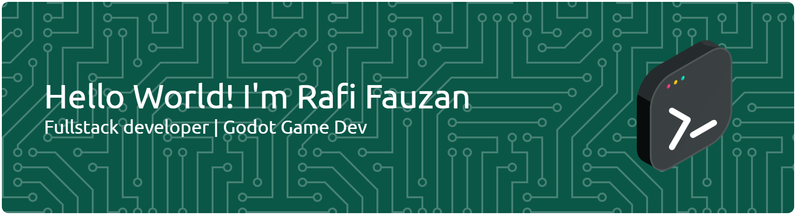

<div align="center">

# 👋 Hi, I'm Rafi Fauzan



<br>


<p>
Building beautiful interfaces, exploring game development,
and continuously learning modern technologies.
</p>


</div>

---

# 💫 About Me

```cpp
class RafiFauzan {

public:

    string location = "Indonesia";

    string role = "Frontend & Game Developer";

    vector<string> interests = {
        "Web Development",
        "Game Development",
        "UI/UX",
        "Artificial Intelligence"
    };

    string currentlyLearning = "Flutter • React • Godot";

};
```

---

# 🚀 Tech Stack

<p align="center">


</p>

---

# 🤖 AI Tools

<p align="center">


</p>

---

# 📊 GitHub Analytics

<div align="center">


</div>

<br>

<div align="center">


</div>

---

# 📈 Contribution Graph

<p align="center">


</p>

---

# 🐍 Contribution Snake

<p align="center">


</p>

---

# 🌐 Connect With Me

<p align="center">

<a href="https://linkedin.com/in/rafi-zeta-fauzan-355621329">

</a>

<a href="https://instagram.com/rafizfxt">

</a>

<a href="https://facebook.com/share/1HKVoQJ9UJ/">

</a>

</p>

---

<div align="center">

### ⭐ Thanks for visiting my profile!

*"Code. Learn. Build. Repeat."*

</div>